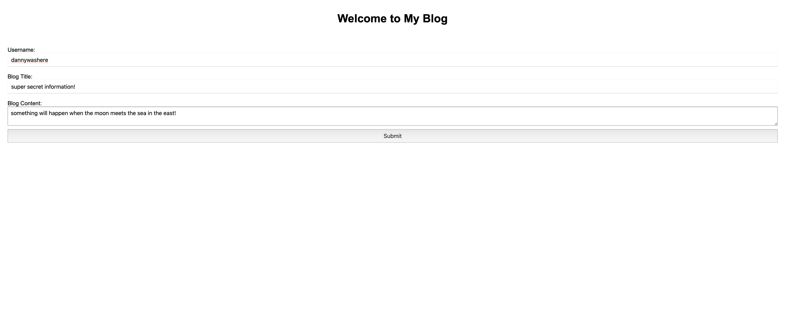
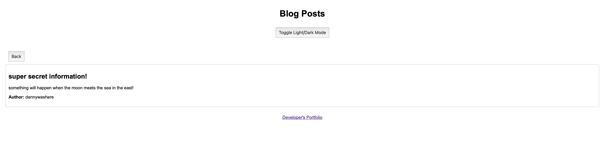
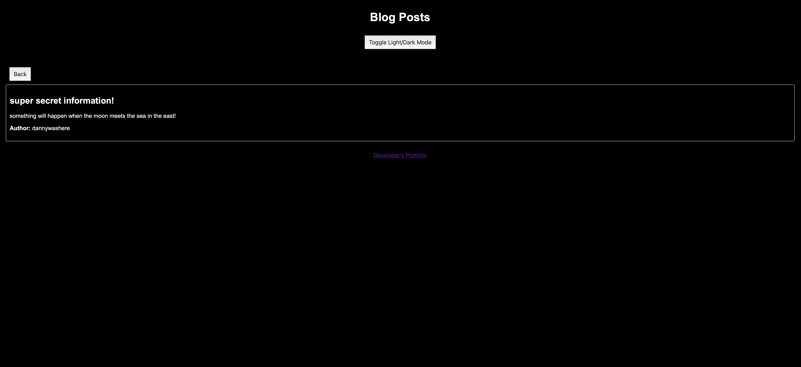

# My Personal Blog

Welcome to My Personal Blog! This project is a simple personal blog application that allows you to create, store, and view blog posts. It's a perfect platform to showcase your thoughts and experiences.

## Table of Contents

- [Features](#features)
- [Getting Started](#getting-started)
- [Usage](#usage)
- [File Structure](#file-structure)
- [Screenshots](#screenshots)
- [Contributing](#contributing)
- [License](#license)

## Features

- Create new blog posts with a username, title, and content.
- Store blog posts in `localStorage` for persistent data.
- View a list of all blog posts.
- Toggle between light and dark mode for a better reading experience.
- Navigate back to the main page to add more entries.

## Getting Started

### Prerequisites

To run this project, you need a web browser.

### Installation

1. **Clone the repository:**
    ```bash
    git clone https://github.com/your-username/my-blog.git
    ```
2. **Navigate to the project directory:**
    ```bash
    cd my-blog
    ```
3. **Open `index.html` in your browser to get started.**

## Usage

### Adding a Blog Post

1. **Open the main page:**
    Open `index.html` in your browser.
2. **Fill out the form:**
    Enter your username, blog title, and content.
3. **Submit the form:**
    Click the "Submit" button to save your post.

### Viewing Blog Posts

1. **After submitting a post:**
    You will be redirected to the blog posts page (`blog.html`).
2. **View the posts:**
    All the posts will be displayed in a list format.
3. **Toggle Light/Dark Mode:**
    Click the "Toggle Light/Dark Mode" button to switch between themes.

### Navigating Back

- **Click the "Back" button:** 
  This will redirect you back to the main page (`index.html`) where you can input more blog entries.

## File Structure
```bash
my-blog
├── assets
│ ├── css
│ │ ├── blog.css
│ │ ├── form.css
│ │ └── styles.css
│ └── js
│ ├── blog.js
│ ├── form.js
│ └── logic.js
├── index.html
├── blog.html
└── README.md
```
- `assets/css/blog.css`: Styles for the blog posts page.
- `assets/css/form.css`: Styles for the form page.
- `assets/css/styles.css`: General styles for both pages.
- `assets/js/blog.js`: Handles displaying posts and theme toggle functionality.
- `assets/js/form.js`: Handles form submission and localStorage operations.
- `assets/js/logic.js`: Additional logic, such as theme toggle.
- `index.html`: The main page with the form.
- `blog.html`: The page displaying the list of blog posts.

## Screenshots

### Main Page



### Blog Posts Page (Light Mode)



### Blog Posts Page (Dark Mode)



## Contributing

1. **Fork the repository.**
2. **Create your feature branch:**
    ```bash
    git checkout -b feature/YourFeature
    ```
3. **Commit your changes:**
    ```bash
    git commit -m 'Add YourFeature'
    ```
4. **Push to the branch:**
    ```bash
    git push origin feature/YourFeature
    ```
5. **Open a pull request.**

## License

This project is licensed under the MIT License. See the [LICENSE](LICENSE) file for details.


Credits: 
Daniel Kramer
Northwestern University Coding Bootcamp
Module 4 Challenge