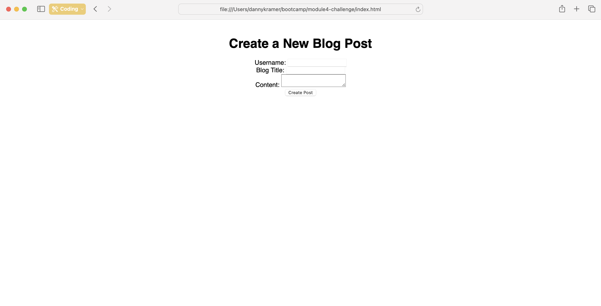

# Module4-challenge
## Project Title: Module 4 Challenge (JavaScript)

### Description: 
This repository contains the challenge for our week four bootcamp module, which involed writing code from scratch to create a simple blog website. Various subjects we studied during class were helpful for this module challenge that delved deeper into JavaScript and how it brings life to webpages.  

### Included in the repository:
    - 1 READ.me file containing a screenshot of the webpage
    - 1 assets folder, containing:
        *css folder
            / blog.css
            / form.css
            / styles.css
        *js folder
            / blog.js
            / form.js
            / logic.js
    - 1 index.html file
    - 1 blog.html file

Credits: 
Daniel Kramer
Northwestern University Coding Bootcamp
Module 4 Challenge